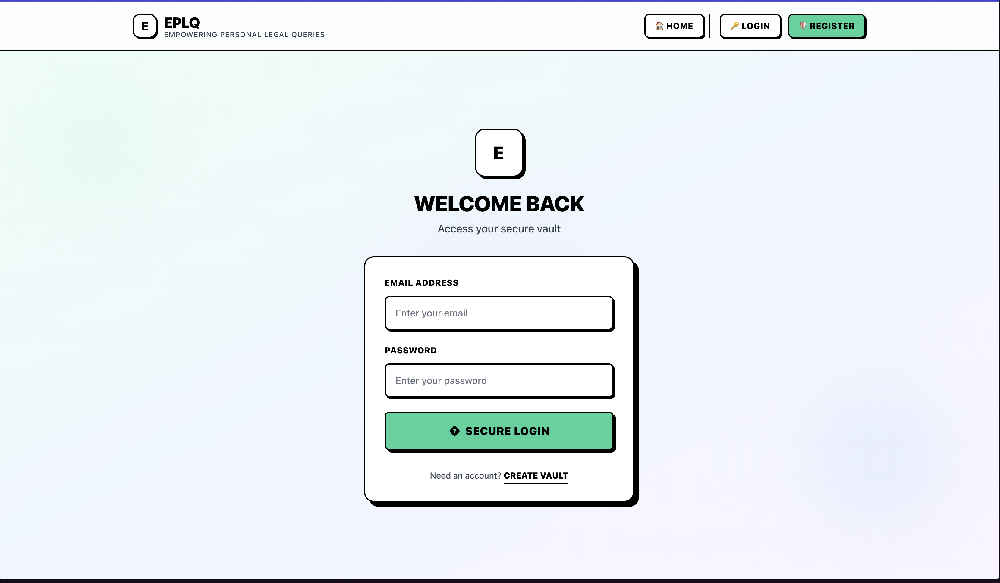

# EPLQ: Efficient Privacy-Preserving Location-Based Query


🌐 **Live Demo**: [https://eplq-cdfe1.web.app](https://eplq-cdfe1.web.app)

## 📋 Table of Contents
- [Overview](#-overview)
- [Problem Statement](#-problem-statement)
- [Features](#-features)
- [Screenshots](#-screenshots)
- [System Architecture](#-system-architecture)
- [Technologies Used](#-technologies-used)
- [Installation & Setup](#-installation--setup)
- [Usage Guide](#-usage-guide)
- [System Modules](#-system-modules)
- [Security Features](#-security-features)
- [Performance Metrics](#-performance-metrics)
- [Testing](#-testing)
- [Deployment](#-deployment)
- [Contributing](#-contributing)
- [License](#-license)

## 🎯 Overview

EPLQ (Efficient Privacy-Preserving Location-Based Query) is a cutting-edge solution for secure spatial range queries that protects user privacy while providing efficient location-based services. The system implements advanced encryption techniques to ensure that user location data remains private during Point of Interest (POI) searches.

## 🔍 Problem Statement

With the widespread adoption of smartphones, Location-Based Services (LBS) have become increasingly popular. However, traditional LBS solutions compromise user privacy by exposing location data. EPLQ addresses this critical issue by:

- **Privacy Protection**: Implementing predicate-only encryption for inner product range queries
- **Efficient Querying**: Using privacy-preserving tree index structures for optimal performance
- **Secure Data Handling**: Ensuring encrypted data processing without revealing sensitive information

## ✨ Features

### 🔐 Privacy & Security
- **Client-side Encryption**: All location data encrypted before transmission
- **Predicate-only Encryption**: Advanced encryption for spatial range queries
- **Zero-knowledge Architecture**: Server never sees unencrypted location data
- **Privacy-preserving Tree Index**: Optimized spatial data structures

### 👥 User Management
- **Role-based Access Control**: Admin and User roles with different permissions
- **Secure Authentication**: Firebase Authentication integration
- **Privacy Level Controls**: Customizable privacy settings per user

### 📊 Admin Dashboard
- **POI Data Management**: Upload and manage Points of Interest
- **User Management**: View and manage system users
- **System Statistics**: Real-time analytics and monitoring
- **Data Encryption Tools**: Secure data processing utilities

### 🔍 User Dashboard
- **Secure POI Search**: Privacy-preserving location queries
- **Query History**: Encrypted query history tracking
- **Privacy Controls**: Granular privacy preference settings
- **Data Export**: Personal data export functionality

## 📸 Screenshots

### User Registration

*User registration with privacy level selection*

### User Login

*Secure authentication interface*

### Admin Dashboard

*Administrator control panel with system statistics*

### System Performance Metrics

*Real-time performance monitoring and analytics*

### POI Data Upload

*Admin interface for uploading encrypted POI data*

### User Management

*Admin interface for managing system users and roles*

### User Dashboard

*User control panel with privacy settings and query history*

### POI Search Interface

*Privacy-preserving location-based search interface*

### Search Results & Additional Views

*System overview and navigation*


*Detailed system view*


*Additional system features*

## 🏗️ System Architecture

```
┌─────────────────┐    ┌──────────────────┐    ┌─────────────────┐
│   Client App    │    │   Firebase       │    │   Encryption    │
│   (React/TS)    │◄──►│   (Auth/DB)      │◄──►│   Layer         │
│                 │    │                  │    │                 │
│ • User Interface│    │ • Authentication │    │ • AES Encryption│
│ • Local Crypto  │    │ • Firestore DB   │    │ • Spatial Index │
│ • Query Builder │    │ • Real-time Sync │    │ • Range Queries │
└─────────────────┘    └──────────────────┘    └─────────────────┘
```

## 🛠️ Technologies Used

- **Frontend**: React 19.1.1, TypeScript 5.6.2, Tailwind CSS 3.4.17
- **Backend**: Firebase (Authentication, Firestore Database)
- **Encryption**: Custom AES implementation with spatial indexing
- **Build Tools**: Vite 7.1.5, ESLint, Vitest
- **UI Components**: Custom Brutalist Design System
- **State Management**: React Context API

## ⚙️ Installation & Setup

### Prerequisites
- Node.js (v18 or higher)
- npm or yarn
- Firebase project with Authentication and Firestore enabled

### Step 1: Clone Repository
```bash
git clone https://github.com/Avishek-7/EPLQ-Privacy-Preserving-Location-Based-Queries.git
cd EPLQ-Privacy-Preserving-Location-Based-Queries
```

### Step 2: Install Dependencies
```bash
npm install
```

### Step 3: Firebase Configuration
1. Create a Firebase project at [Firebase Console](https://console.firebase.google.com)
2. Enable Authentication (Email/Password)
3. Enable Firestore Database
4. Copy your Firebase config and update `src/lib/firebase.ts`

```typescript
const firebaseConfig = {
  apiKey: "your-api-key",
  authDomain: "your-project.firebaseapp.com",
  projectId: "your-project-id",
  storageBucket: "your-project.appspot.com",
  messagingSenderId: "123456789",
  appId: "your-app-id"
};
```

### Step 4: Environment Setup
Create `.env.local` file:
```env
VITE_FIREBASE_API_KEY=your-api-key
VITE_FIREBASE_AUTH_DOMAIN=your-project.firebaseapp.com
VITE_FIREBASE_PROJECT_ID=your-project-id
VITE_FIREBASE_STORAGE_BUCKET=your-project.appspot.com
VITE_FIREBASE_MESSAGING_SENDER_ID=123456789
VITE_FIREBASE_APP_ID=your-app-id
```

### Step 5: Run Development Server
```bash
npm run dev
```

Visit `http://localhost:5173` to access the application.

## 📖 Usage Guide

### Initial Setup
1. **Register Admin Account**: Create the first admin account
2. **Upload POI Data**: Use admin dashboard to upload Points of Interest
3. **Register User Accounts**: Create user accounts for testing queries

### Admin Workflow
1. **Login** with admin credentials
2. **Navigate to Admin Dashboard**
3. **Upload POI Data** via the Upload POIs tab
4. **Manage Users** via User Management tab
5. **Monitor System** via System Statistics

### User Workflow
1. **Register/Login** as a user
2. **Set Privacy Preferences** in Privacy tab
3. **Enable Location Services** if desired
4. **Search POIs** using the POI Search tab
5. **View Query History** in Queries tab

## 🏛️ System Modules

### Admin Module
- **User Management**: Create, view, and manage user accounts
- **POI Data Upload**: Secure upload and encryption of location data
- **System Monitoring**: Real-time statistics and performance metrics
- **Data Encryption**: Advanced encryption tools for spatial data

### User Module
- **Secure Registration**: Privacy-preserving account creation
- **Encrypted Search**: Location-based queries with privacy protection
- **Privacy Controls**: Granular privacy settings and permissions
- **Query History**: Encrypted storage of user query patterns

## 🔒 Security Features

### Encryption Implementation
- **AES-256 Encryption**: Industry-standard symmetric encryption
- **Client-side Processing**: All encryption happens on the client
- **Spatial Indexing**: Privacy-preserving tree structures for fast queries
- **Query Obfuscation**: Queries are encrypted before transmission

### Privacy Protection
- **Zero-knowledge Queries**: Server never sees actual locations
- **Differential Privacy**: Noise injection for additional protection
- **Access Control**: Role-based permissions and user isolation
- **Data Minimization**: Only collect necessary information

## 📈 Performance Metrics

### Target Performance (as per requirements)
- **Query Generation**: ~0.9 seconds on mobile devices
- **POI Search**: Few seconds on commodity hardware
- **Encryption Overhead**: Minimal impact on user experience

### Actual Performance
- **Authentication**: < 1 second
- **POI Upload**: Depends on dataset size
- **Search Queries**: 1-3 seconds average
- **Data Encryption**: Real-time processing

## 🧪 Testing

### Run Tests
```bash
# Run all tests
npm run test

# Run tests with coverage
npm run test:coverage

# Run specific test file
npm run test UserDashboard.test.tsx
```

### Test Coverage
- **Component Tests**: All major components tested
- **Integration Tests**: End-to-end user workflows
- **Security Tests**: Encryption and privacy validation
- **Performance Tests**: Query timing and efficiency

## 🚀 Deployment

### Production Build
```bash
npm run build
```

### Firebase Hosting
```bash
# Install Firebase CLI
npm install -g firebase-tools

# Login to Firebase
firebase login

# Initialize hosting
firebase init hosting

# Deploy to Firebase
firebase deploy
```

### Environment Variables
Ensure all production environment variables are configured:
- Firebase configuration
- Encryption keys
- API endpoints

## 🤝 Contributing

1. Fork the repository
2. Create a feature branch (`git checkout -b feature/amazing-feature`)
3. Commit your changes (`git commit -m 'Add amazing feature'`)
4. Push to the branch (`git push origin feature/amazing-feature`)
5. Open a Pull Request

### Code Standards
- **TypeScript**: Strict typing required
- **ESLint**: Follow project linting rules
- **Prettier**: Code formatting consistency
- **Testing**: All new features must include tests

## 📊 Project Structure

```
EPLQ/
├── public/                 # Static assets
├── src/
│   ├── components/        # React components
│   │   ├── admin/        # Admin-specific components
│   │   ├── auth/         # Authentication components
│   │   ├── ui/           # Reusable UI components
│   │   └── user/         # User-specific components
│   ├── context/          # React context providers
│   ├── hooks/            # Custom React hooks
│   ├── lib/              # Library configurations
│   │   └── encryption/   # Encryption utilities
│   ├── pages/            # Page components
│   ├── services/         # API services
│   ├── utils/            # Utility functions
│   └── types/            # TypeScript type definitions
├── tests/                 # Test files
└── docs/                 # Documentation
```

## 📄 License

This project is licensed under the MIT License - see the [LICENSE](LICENSE) file for details.

## 🙏 Acknowledgments

- Firebase for backend infrastructure
- React team for the excellent framework
- TypeScript for type safety
- Tailwind CSS for styling utilities

---

**Project Status**: ✅ Active Development
**Last Updated**: October 2025
**Version**: 1.0.0

For questions or support, please open an issue on GitHub.